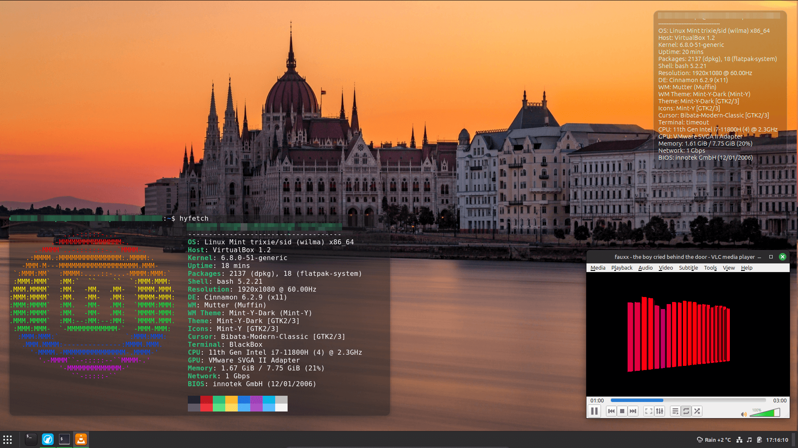

# riceathon-sub

Echo's riceathon submission. A simple rice with a focus on keeping things to the basics. (aka I'm lazy)

Desktop Background: [Photo from Seth Fogelman of the parliament building in Budapest, Hungary](https://unsplash.com/photos/white-and-red-concrete-building-near-body-of-water-Dzv_m1LhcHc)

Cusor pack: [DJ-Fox-C](https://store.kde.org/p/2113007/) (not shown in screenshot)

Config exported with [SaveDesktop](https://flathub.org/apps/io.github.vikdevelop.SaveDesktop)